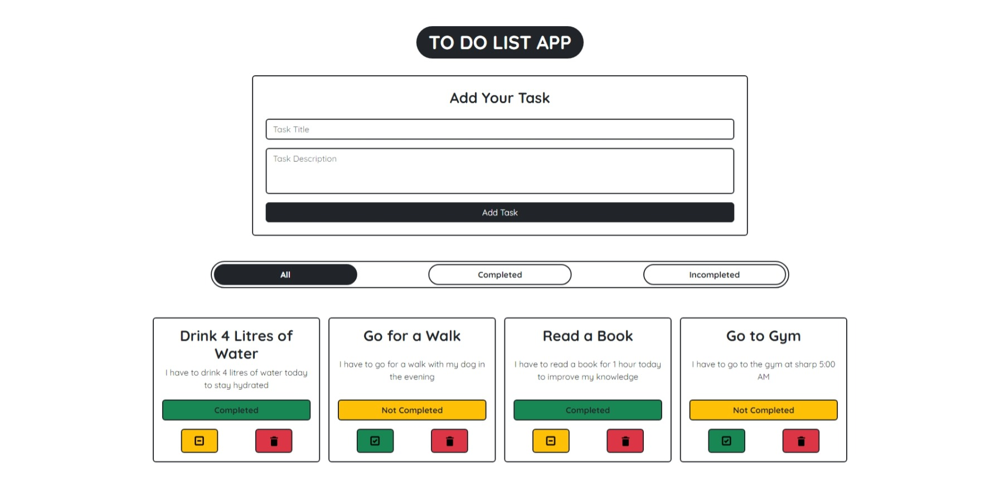

# To-Do-List-App

SimpleToDo is a minimalist to-do list web application built using HTML, CSS, and JavaScript. It allows users to efficiently manage tasks by adding, deleting, marking as completed or incomplete, and filtering tasks based on their status. A clean and intuitive interface ensures seamless task management for enhanced productivity.

## Feautres
- Add Tasks
- Delete Tasks
- Mark Tasks as Completed or Incompleted
- Filter Tasks on the basis of their completion
- Can check your tasks at any time (uses Local Storage to store tasks locally in your device)

## Views to My Project 

---

<h3 style='margin-top:0'>Made with ❤️ in Bharat by Lokesh Jaglan</h3>
